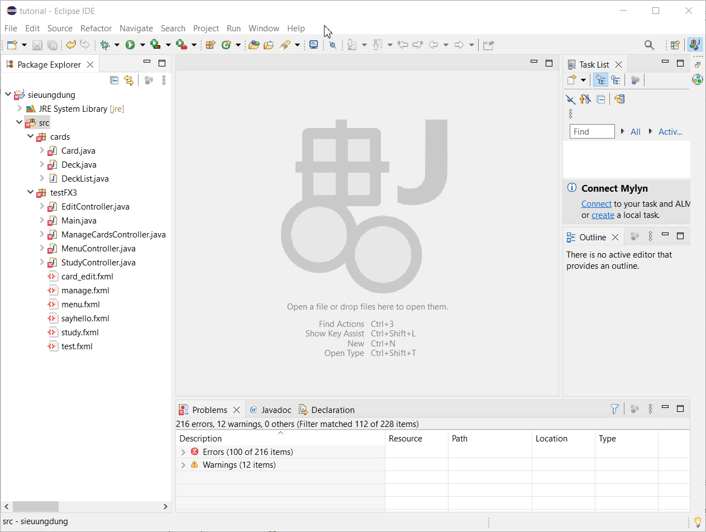
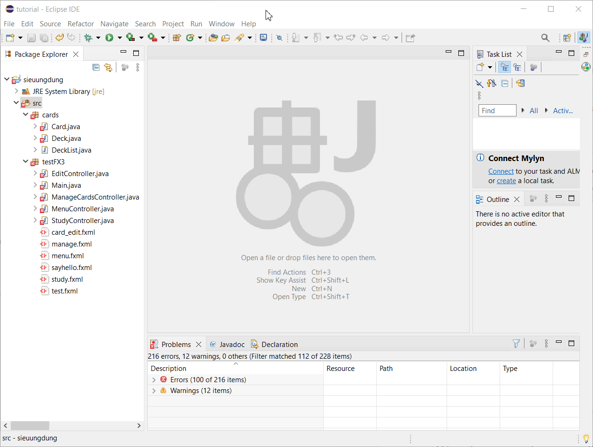
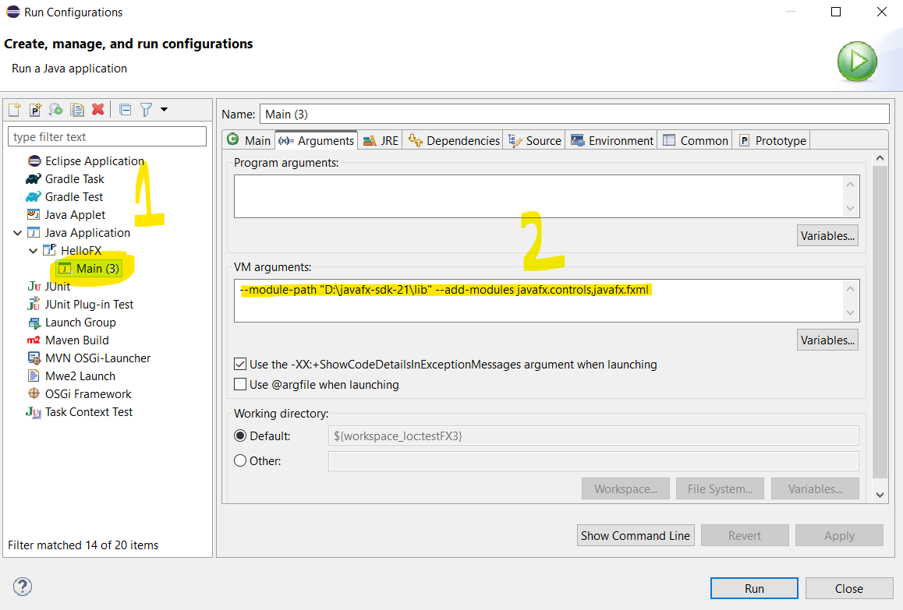
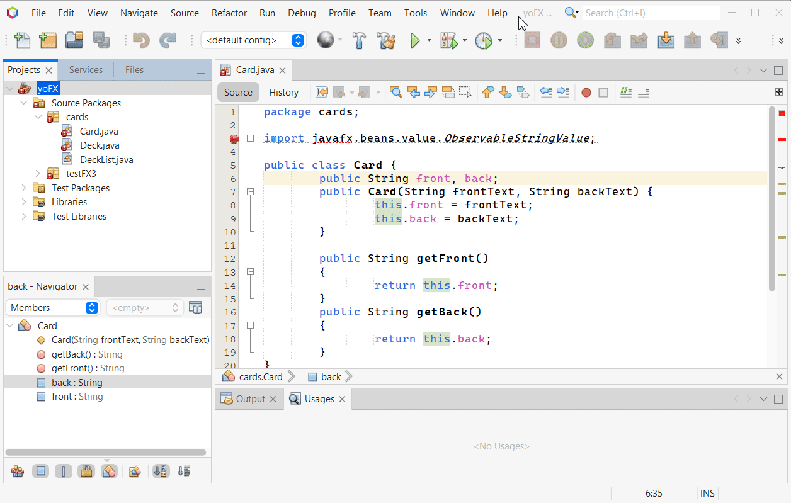
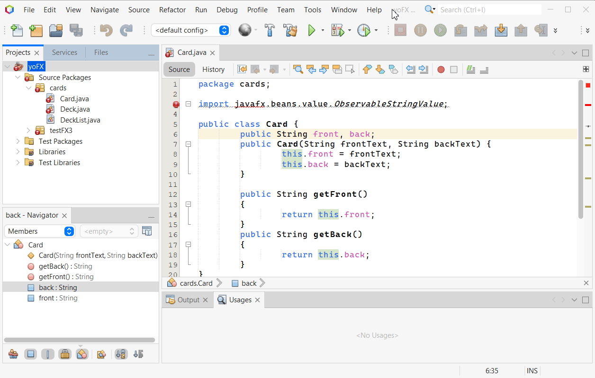
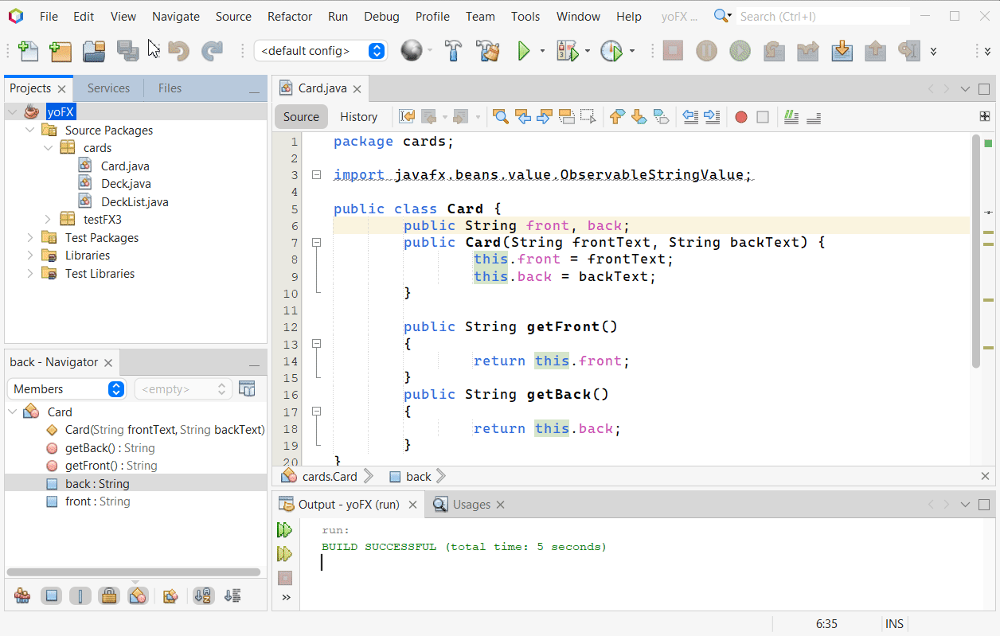

# Siêu ứng dụng FlashCard

## Hướng dẫn dịch và chạy siêu ứng dụng

### Tóm tắt: 
* Tải [thư mục/zip src ở trên hoặc tại đây](https://github.com/uxlem/sieuungdung_jfx/releases/tag/pre)

* Copy thư mục src trên này vào project trống trên máy của mọi người, thêm VM Arguments và chạy hoy

Tham khảo https://openjfx.io/openjfx-docs/#introduction và youtube

Trong trường hợp ae nào cần hướng dẫn cụ thể hơn thì 

### Hướng dẫn cụ thể

0. [Bước chuẩn bị]
   
    Tải javafx-**sdk** tại https://gluonhq.com/products/javafx/ (chú ý chọn tải sdk), giải nén, trong đó có thư mục `lib`

    Mình dùng bản 21.0.2 LTS

1. Tạo một project trống bằng IDE của mọi người

2. Thêm các file trong thư mục src trên này vào project vừa tạo (copy paste)

    Với IDE Eclipse, sau khi copy file vào trong thư mục src, bấm `F5` để Refresh để thấy các file đã copy trong `Package Explorer`.

3. Thêm thư viện javafx-sdk vào Classpath của project, thêm VM arguments khi chạy

    Hướng dẫn cụ thể hơn nữa cho từng IDE ở bên dưới, nếu đọc hướng dẫn khó hiểu quá hãy xem youtube nhé 🥺

    * [Với IDE IntelliJ](#với-ide-intellj)
    * [Với IDE Eclipse](#với-ide-eclipse)
    * [Với IDE NetBeans](#với-ide-netbeans)

4. Bấm chạy thôi <3
    
#### Với IDE IntellJ
Vui lòng xem trang tham khảo đã ghi ở trên, trong đó có cả hướng dẫn cho Eclipse và NetBeans, hoặc là YouTube. :=) mình chưa cài IntelliJ chưa viết hướng dẫn được.

#### Với IDE Eclipse
##### 1. Thêm thư viện javafx vào "Classpath"

* Nếu chưa cài e(fx)clipse

    Tạo một User Library gồm các "thư viện" của JavaFX như sau:

    * Trên Menu Bar (thanh dưới thanh tiêu đề cửa sổ), chọn `Window > Preferences > Java > Build Path > User Libraries`
   
    * Chọn `New` và ghi tên thư viện mới của mình, ví dụ: `JavaFX21`
    * Bấm chọn thư viện vừa tạo, chọn `Add External JARs`, tìm đến thư mục `lib` trong thư mục chứa javafx-sdk, chọn thư mục lib đó hoặc tất cả các file .jar bên trong.
    * `Apply and Close`.
    
    GIF minh hoạ:
    

* Nếu đã cài e(fx)clipse
    * Mở `Window > Preferences > JavaFX`
    * Chỉnh phần `JavaFX 11 SDK` thành đường dẫn thư mục `lib` của javafx-sdk

Sau đó ta thêm Library vào Classpath của Project:

* Mở `Project > Properties > Java Build Path > Libraries`
* Bấm chọn `Classpath`, chọn `Add Library...`

    * Nếu chưa cài e(fx)clipse: chọn `User Library` và chọn thư viện vừa tạo ở trên.

    * Nếu đã cài e(fx)clipse: chọn `JavaFX SDK`

* `Apply and Close`.

##### 2. Thêm VM Arguments
* Mở `Run > Run Configurations`
    * Hoặc là chọn vào `Java Applications` rồi bấm `New Configurations`
    * Hoặc là **chọn luôn Run Configurations đang có, như hình (đánh dấu số 1)**

    

* Chọn thẻ `Arguments`, thêm vào phần `VM arguments` dòng sau:

            --module-path $PATH_TO_FX$ --add-modules javafx.controls,javafx.fxml

    trong đó `$PATH_TO_FX$` là địa chỉ của thư mục `lib` của javafx-sdk. 
    
    Nếu đã có `$PATH_TO_FX$` sẵn trong `Environment Variables` thì không cần phải thay cụ thể như trong ảnh trên. 🤔

#### Với IDE NetBeans
1. Tạo 1 Library gồm các file .jar của thư mục `lib`

    Chọn `Tools > Libraries > New Library`, điền tên thư viện mới, chọn `Add JAR/Folder...`

    

    Vì một lí do gì đấy chưa rõ, khi mình bấm thêm mỗi thư mục `lib` thì nó hơi lỗi lỗi xíu, còn khi vào hẳn trong thư mục `lib` để thêm .jar thì sẽ bình thường.

2. Thêm library vào Classpath khi compile và Modulepath khi chạy *(mình hiểu là như thế, sai mn thông cảm)*
    
    Chọn project đang mở, `File > Project Properties` hoặc `chuột phải > Properties`

    Chọn `Libraries`, chọn thẻ `Compile > Classpath +`, thêm thư viện vừa tạo;

    Sau đó sang thẻ `Run > Modulepath +`, lại thêm thư viện vừa tạo.

    

3. Tiếp tục mở `Project Properties > Run`, thêm VM Arguments dưới đây vào `VM Options`:
        
        --module-path $PATH_TO_FX$ --add-modules javafx.controls,javafx.fxml

    **Lưu ý:** nếu chưa đặt biến `$PATH_TO_FX$` trong `Environment Variables` của Windows thì cần thay `$PATH_TO_FX$` bằng địa chỉ thư mục `lib`, ví dụ `D:\jfx21\lib`

    